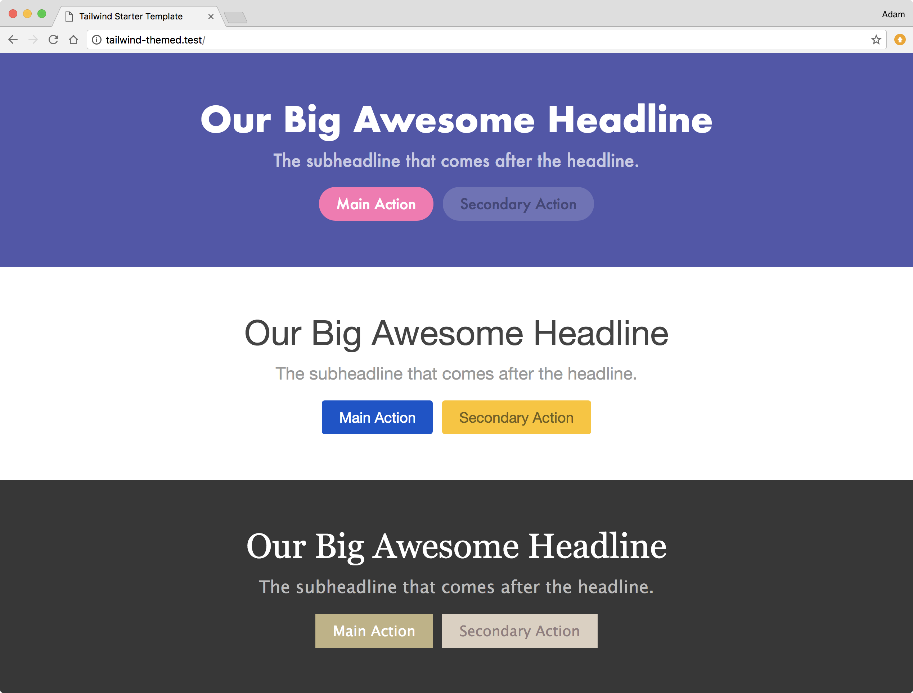

# Using Tailwind CSS for Themeable Interfaces



This is really basic demo showing how you might approach configuring [Tailwind CSS](https://tailwindcss.com) if you needed an interface to support multiple themes.

The basic premise is to define your styles in your config file using [CSS Custom Properties](https://developer.mozilla.org/en-US/docs/Web/CSS/--*), and use a more functional/"semantic" naming scheme for your classes.

For example, here's how the text colors are defined in this demo:

```js
textColor: {
    primary: "var(--color-text-primary)",
    secondary: "var(--color-text-secondary)",
    default: "var(--color-text-default)",
    "default-soft": "var(--color-text-default-soft)",
    inverse: "var(--color-text-inverse)",
    "inverse-soft": "var(--color-text-inverse-soft)"
},
```

Each theme then defines these custom properties inside of their own theme class:

```css
.theme-startup {
  --color-text-primary: #fff;
  --color-text-secondary: #44467b;
  --color-text-default: #373737;
  --color-text-default-soft: #6a6a6a;
  --color-text-inverse: #fff;
  --color-text-inverse-soft: rgba(255, 255, 255, 0.7);
}

.theme-boring {
  --color-text-primary: #fff;
  --color-text-secondary: #755f17;
  --color-text-default: #444;
  --color-text-default-soft: #999;
  --color-text-inverse: #444;
  --color-text-inverse-soft: #999;
}

.theme-elegant {
  --color-text-primary: #fff;
  --color-text-secondary: #927e7e;
  --color-text-default: #373737;
  --color-text-default-soft: #6a6a6a;
  --color-text-inverse: #fff;
  --color-text-inverse-soft: #bbb;
}
```
